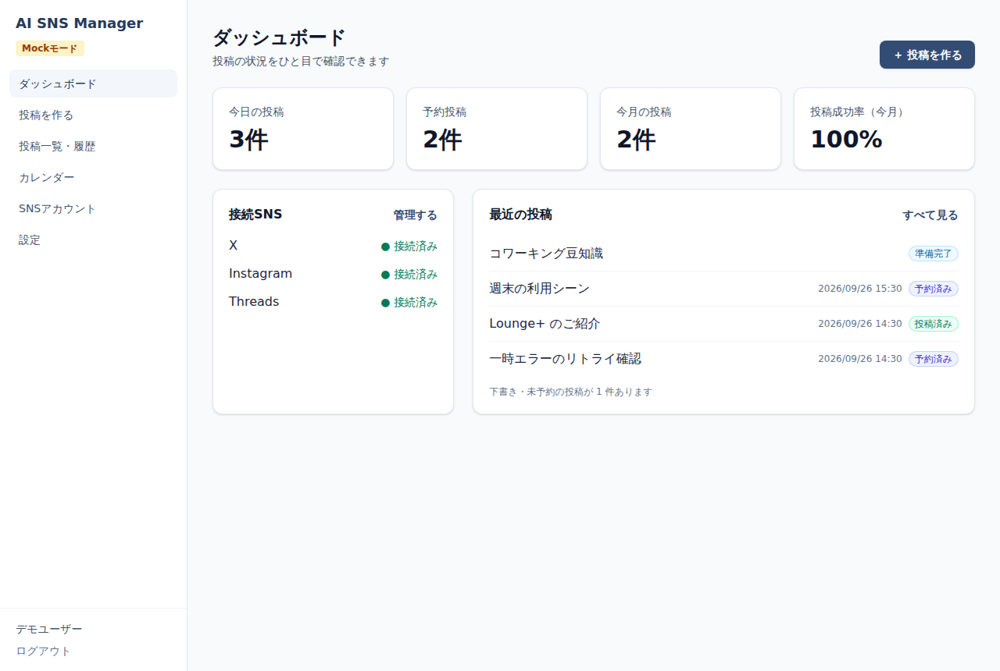
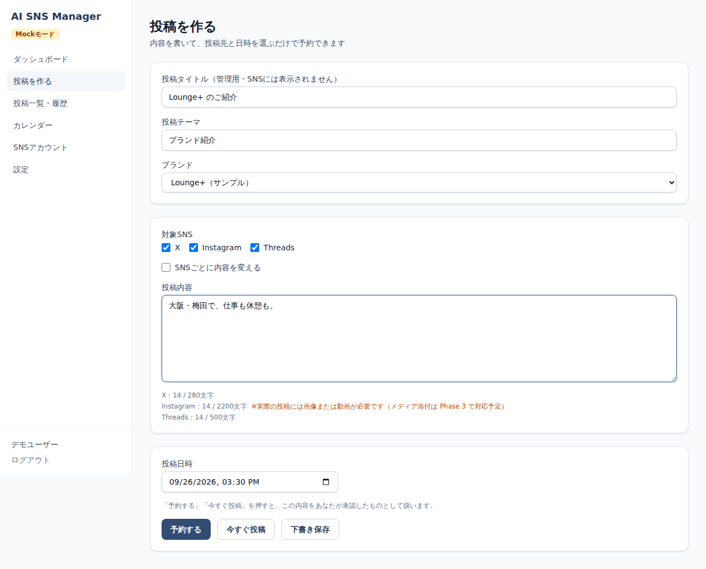
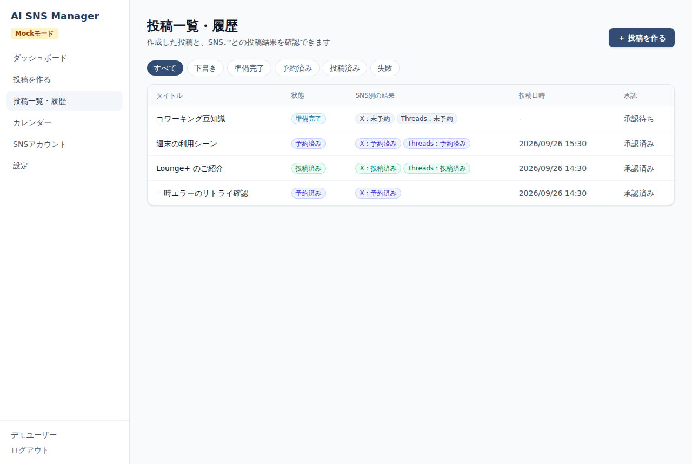
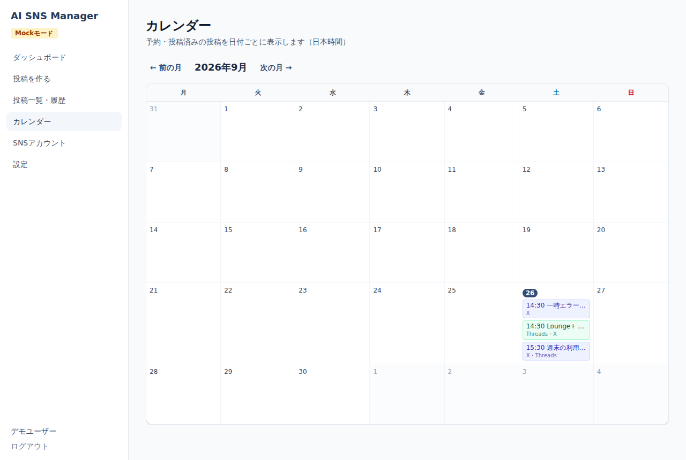
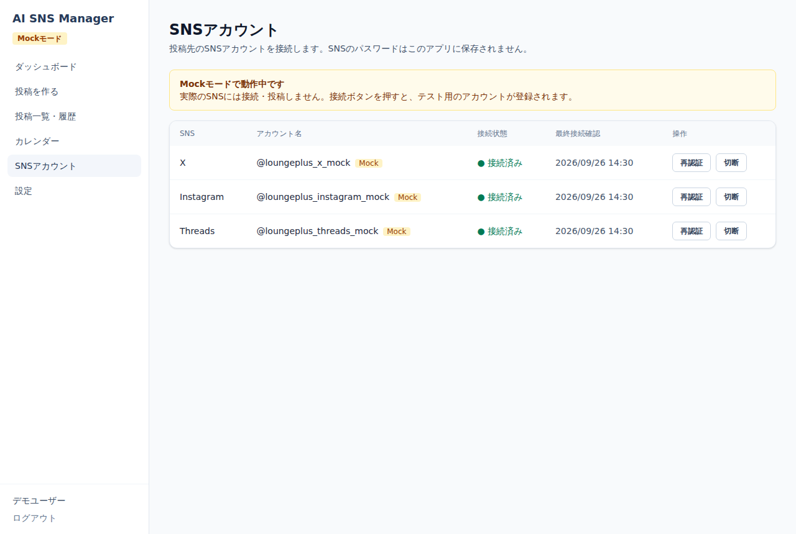
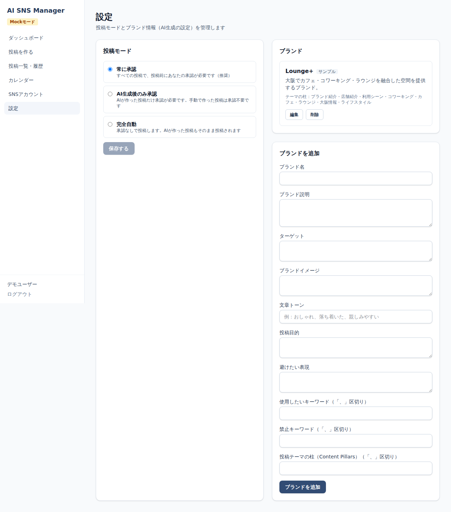
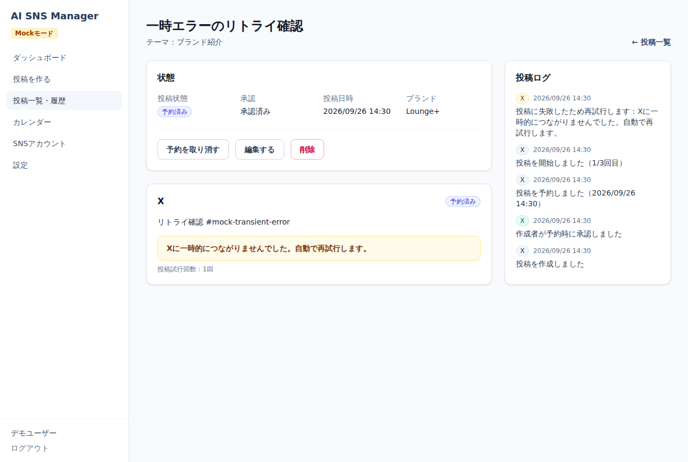

# AI SNS Manager

X・Instagram・Threads への投稿を一元管理する Web アプリです。
最終的には「SNS 運用そのものを AI が支援・自動化するプラットフォーム」を目指します。

> **現在の状態：Phase 1（MVP）完了。** 実際の SNS への投稿は未対応で、**Mock モード**で動作します。
> AI による投稿生成は Phase 2、画像・動画生成は Phase 3 で実装予定です（→ [ロードマップ](#ロードマップと未実装機能)）。

---

## 概要

| 項目 | 内容 |
| --- | --- |
| Frontend | Next.js 15（App Router）/ React 19 / TypeScript / Tailwind CSS 4 |
| Backend | Next.js Route Handlers / TypeScript |
| DB | PostgreSQL 16 + Prisma 6 |
| 認証 | Auth.js v5（メールアドレス + パスワード。パスワードは bcrypt でハッシュ化） |
| ジョブキュー | Redis + BullMQ（投稿は必ず Worker が非同期で実行） |
| テスト | Vitest（単体・統合）/ Playwright（E2E） |

基本操作は 5 ステップです：**① 投稿を作る → ②（Phase 2）AI に案を作らせる → ③ 採用・承認 → ④ 投稿日時を決める → ⑤ 投稿する**

## 機能（Phase 1）

- **ログイン / ユーザー登録**（メールアドレス + パスワード）
- **ダッシュボード**：接続 SNS、今日の投稿、予約投稿、今月の投稿、投稿成功率、最近の投稿
- **SNS アカウント管理**：接続・再認証・切断（OAuth 方式。SNS のパスワードは保存しない。トークンは AES-256-GCM で暗号化保存）
- **投稿作成・編集**：タイトル、テーマ、ブランド、対象 SNS、SNS ごとの本文、文字数チェック
- **承認**：投稿モード「常に承認（初期値）/ AI 生成後のみ承認 / 完全自動」。承認・却下
- **予約投稿 / 今すぐ投稿**：BullMQ の遅延ジョブで実行。Web リクエスト内では投稿しない
- **自動リトライ**：一時的なエラーは 30 秒後 → 2 分後に再試行（最大 3 回）。認証・権限・内容エラーは再試行しない
- **二重投稿防止**：`postId:platform` を冪等キーにしてジョブ ID と状態遷移で保護
- **カレンダー**：月表示（月曜始まり・日本時間）
- **投稿一覧・履歴**：状態で絞り込み、SNS 別の成功/失敗表示
- **投稿ログ**：作成・承認・予約・投稿開始・成功・失敗・リトライを記録（秘密情報はマスク）
- **ブランド設定**：ブランド名、説明、ターゲット、トーン、キーワード、禁止ワード、投稿テーマの柱など（Phase 2 の AI 生成で使用）
- **Mock モード**：SNS API を呼ばずに OAuth・投稿成功・失敗をシミュレーション

## スクリーンショット

| ダッシュボード | 投稿作成 |
| --- | --- |
|  |  |

| 投稿一覧・履歴 | カレンダー |
| --- | --- |
|  |  |

| SNS アカウント | 設定 |
| --- | --- |
|  |  |

リトライ中の投稿詳細（ユーザーには分かりやすいエラー文、詳細はログへ）：



## セットアップ

必要なもの：Node.js 20 以上、PostgreSQL、Redis（Docker があれば `docker compose` で両方起動できます）。

```bash
git clone <このリポジトリ>
cd ai-sns-manager
npm install

# 環境変数
cp .env.example .env
# AUTH_SECRET と ENCRYPTION_KEY を生成して .env に書く
openssl rand -base64 32   # → AUTH_SECRET
openssl rand -base64 32   # → ENCRYPTION_KEY
```

Windows（PowerShell）で `openssl` が無い場合：

```powershell
[Convert]::ToBase64String((1..32 | ForEach-Object { Get-Random -Maximum 256 }))
```

## 環境変数

| 変数 | 必須 | 説明 |
| --- | --- | --- |
| `DATABASE_URL` | ✅ | PostgreSQL 接続文字列 |
| `REDIS_URL` | ✅ | Redis 接続文字列 |
| `AUTH_SECRET` | ✅ | Auth.js のセッション署名キー |
| `AUTH_URL` | 本番 | 公開 URL（OAuth のリダイレクト URI にも使用） |
| `AUTH_TRUST_HOST` | 本番 | リバースプロキシ配下なら `true` |
| `ENCRYPTION_KEY` | ✅ | OAuth トークン暗号化キー（32 バイトの base64） |
| `SOCIAL_PROVIDER_MODE` | | `mock`（初期値）/ `live`（公式 API。Step 11 以降で実装） |
| `MOCK_TRANSIENT_FAILURE_RATE` | | Mock で一時失敗させる割合（0〜1）。リトライ確認用 |
| `X_CLIENT_ID` / `X_CLIENT_SECRET` など | | 各 SNS の OAuth 情報（live モードで使用予定） |
| `OPENAI_API_KEY` / `FAL_KEY` | | Phase 2 / 3 で使用予定 |
| `TEST_DATABASE_URL` | | 設定すると DB を使う統合テストが実行される |

`.env` は Git 管理対象外です。API キーをソースコードに書かないでください。

## DB 構築

```bash
docker compose up -d        # PostgreSQL と Redis を起動（Docker を使う場合）
npm run db:migrate          # マイグレーション適用 + Prisma Client 生成
npm run db:seed             # 開発用サンプル（demo@example.com / demo-password、ブランド「Lounge+」）
```

サンプルデータは `isSample` フラグ付きで作成され、本番環境（`NODE_ENV=production`）では投入されません。
テーブル設計は [docs/database.md](docs/database.md) を参照してください。

## Redis

予約投稿は BullMQ（Redis）の遅延ジョブで実行します。**Web サーバーとは別に Worker プロセスが必要です。**

```bash
npm run worker
```

Worker は起動時に「DB では予約中なのにキューにジョブが無い」投稿を再登録します（Redis のデータ消失対策）。

## SNS API 設定

Phase 1 は Mock モードのみ対応です。`SOCIAL_PROVIDER_MODE=mock` のまま使ってください。

- アカウント画面で「接続」を押すと、テスト用アカウントが登録されます（OAuth の往復を模擬）
- 投稿本文に次のタグを入れると失敗を再現できます
  - `#mock-auth-error`：接続切れ（再試行せず失敗、アカウントは「再認証が必要」に）
  - `#mock-content-error`：投稿内容エラー（再試行せず失敗）
  - `#mock-transient-error`：一時的な障害（30 秒 → 2 分と再試行し、3 回目で失敗）

公式 API（X / Instagram Graph API / Threads API）の連携は、実装時点の公式ドキュメントを確認してから
Step 11〜13 で実装します。OAuth のリダイレクト URI は `{AUTH_URL}/api/social/{x|instagram|threads}/callback` です。
詳細は [docs/social-api.md](docs/social-api.md)。

## AI API 設定

Phase 2 で OpenAI API による投稿生成を実装予定です（`OPENAI_API_KEY`）。
現在 `POST /api/posts/:id/generate` は 501 を返します。プロンプトは `prompts/` に分離して管理します。

## 開発方法

```bash
npm run dev      # http://localhost:3000
npm run worker   # 別ターミナルで Worker を起動
```

| コマンド | 内容 |
| --- | --- |
| `npm run dev` | 開発サーバー |
| `npm run worker` | 投稿 Worker |
| `npm run lint` | ESLint |
| `npm run typecheck` | 型チェック |
| `npm test` | 単体・統合テスト（Vitest） |
| `npm run test:e2e` | E2E テスト（Playwright） |
| `npm run build` | 本番ビルド |
| `npm run db:studio` | Prisma Studio で DB を確認 |

設計の詳細：[アーキテクチャ](docs/architecture.md) / [API](docs/api.md) / [DB](docs/database.md)。
開発ルールは [CLAUDE.md](CLAUDE.md) にまとめています。

## テスト

```bash
npm test
```

- **単体テスト**：トークン暗号化、Mock SNS Adapter、投稿バリデーション、予約日時・カレンダー計算、リトライ間隔、状態集計、ログのマスク
- **統合テスト**（`TEST_DATABASE_URL` / `REDIS_URL` が設定されているとき）：投稿作成 → 承認 → 予約 → 投稿、二重投稿防止、リトライ、失敗時の状態、他ユーザーからのアクセス拒否、キュー登録・取消
- **E2E**：`npm run build` 後に `npm run test:e2e`。アプリと Worker を起動し、登録 → ログイン → SNS 接続 → 投稿作成 → 承認 → 今すぐ投稿 → 予約 → カレンダー → 失敗表示までを確認します
  - Playwright のブラウザ：`npx playwright install chromium`（インストール済みのものを使う場合は `PLAYWRIGHT_CHROMIUM_EXECUTABLE` にパスを指定）

テスト用 DB は開発用と分けてください（例：`ai_sns_manager_test` を作成し `DATABASE_URL=<テスト用> npx prisma migrate deploy`）。

## デプロイ

Web サーバー・Worker・PostgreSQL・Redis の 4 つが必要です。Render や Railway なら
「Web Service + Background Worker + PostgreSQL + Redis」の構成で動かせます。
Vercel だけでは常駐 Worker を動かせないため、Worker は別ホストが必要です。
手順は [docs/deployment.md](docs/deployment.md)。

```bash
npm run build && npm run db:deploy
npm run start     # Web
npm run worker    # Worker（別プロセス）
```

## トラブルシューティング

| 症状 | 対処 |
| --- | --- |
| 予約した投稿がいつまでも「予約済み」のまま | Worker（`npm run worker`）が起動しているか確認してください |
| 「予約処理を開始できませんでした」 | Redis に接続できていません。`REDIS_URL` と Redis の起動を確認してください |
| 「◯◯のアカウントが接続されていません」 | アカウント画面で接続してください。モードを切り替えた場合は再接続が必要です（Mock と live のアカウントは混在できません） |
| `ENCRYPTION_KEY は32バイト…` | `openssl rand -base64 32` で生成した値を設定してください。**運用開始後に変更すると保存済みトークンが復号できなくなります**（再接続が必要） |
| ログインできない | `AUTH_SECRET` が設定されているか、本番では `AUTH_URL` / `AUTH_TRUST_HOST` を確認してください |
| Prisma のエラー | `npm run db:migrate` を実行し、`DATABASE_URL` を確認してください |

## ロードマップと未実装機能

| Phase | 内容 | 状態 |
| --- | --- | --- |
| 1 | ログイン、Dashboard、ブランド、SNS アカウント（Mock）、投稿作成・編集・承認・予約、キュー・リトライ、カレンダー、履歴、ログ | ✅ 完了 |
| 2 | AI 投稿生成（5 案）、SNS 別最適化、Brand Voice、禁止ワードチェック、再生成 | 未着手 |
| 3 | 画像・動画生成（fal.ai）、AI スケジュール、AI Agent、完全自動モード | 未着手 |
| 4 | 分析、AI 分析、複数ブランド・SNS 拡張 | 未着手 |

Phase 1 時点で実装していないもの（理由）：

- **X / Instagram / Threads の公式 API 連携**：開発順序（Step 11〜13）に従い、公式ドキュメントを確認してから実装するため。各 Adapter は現在「未実装」エラーを返します
- **Instagram へのメディア付き投稿**：Instagram は画像・動画が必須ですが、メディア添付は Phase 3 で対応するため。Mock モードでは警告表示のうえ投稿を許可しています
- **カレンダーのドラッグ＆ドロップ**：Phase 1 は日時指定で予約する方針のため
- **トークンの自動更新（refresh）**：Adapter に `refreshToken` を定義済み。live 連携実装時に Worker から呼び出す予定
- **パスワードリセット・メール認証**：メール送信基盤が未導入のため
